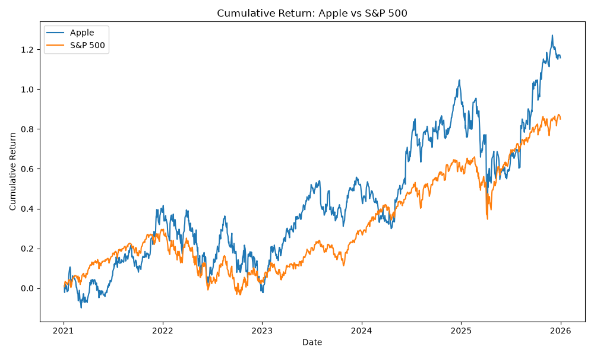
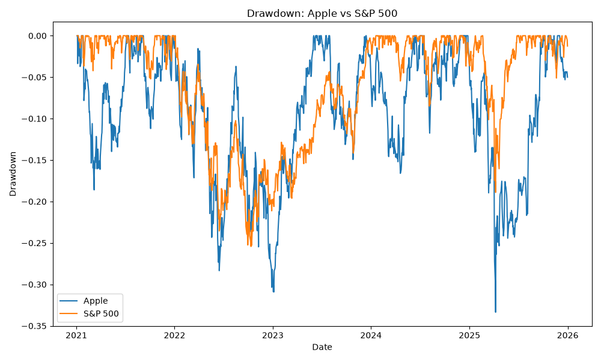
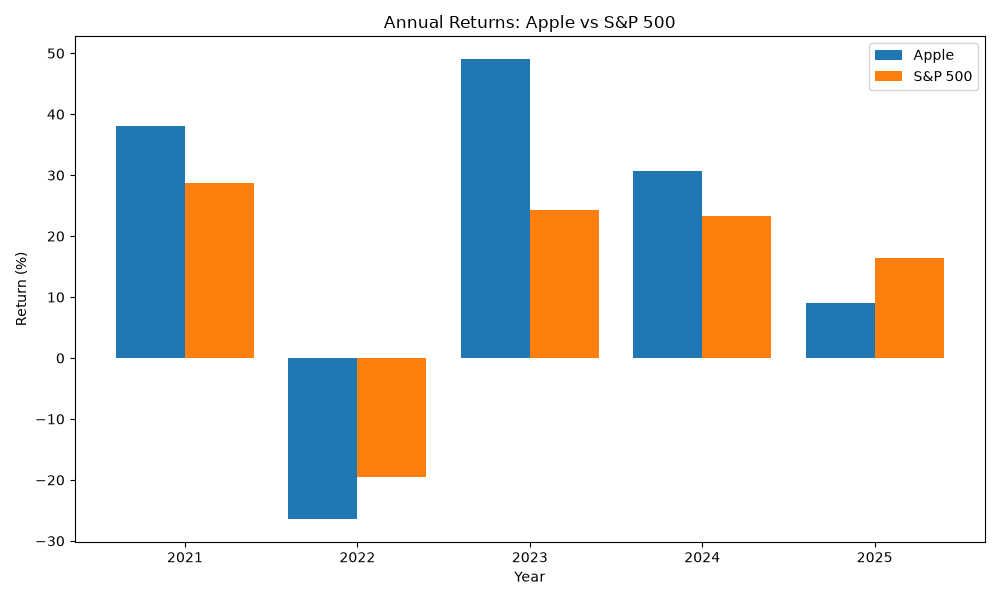
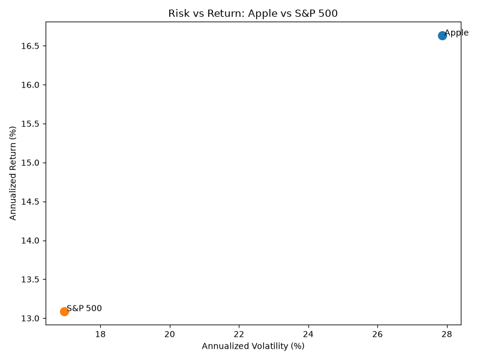
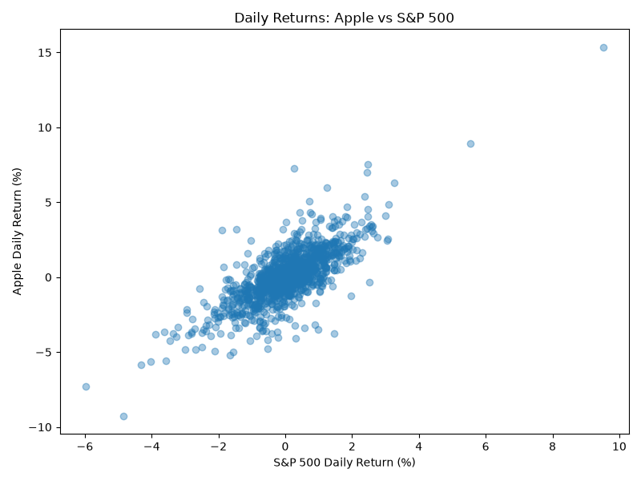

# Stock Performance & Risk Analyzer

A finance data analysis project built with Python, pandas, yfinance, and Matplotlib to evaluate Apple's historical performance and risk relative to the S&P 500.

## Project Overview

This project analyzes Apple Inc. (AAPL) against the S&P 500 (^GSPC) over the 2021–2025 period.

The objective is to answer a simple investment-analysis question:

> Did Apple's additional return over the S&P 500 justify the additional risk taken?

The analysis evaluates both performance and risk using historical market data, including cumulative returns, annualized returns, volatility, drawdowns, annual performance, correlation, and beta.

## Analysis Objectives

The project aims to:

- Measure Apple's total and annualized return over the 2021–2025 period.
- Compare Apple's performance with the S&P 500 benchmark.
- Evaluate risk using annualized volatility and maximum drawdown.
- Compare return relative to volatility.
- Examine Apple's performance across individual calendar years.
- Measure how closely Apple moves with the broader market using correlation.
- Estimate Apple's market sensitivity using beta.
- Visualize the relationship between risk and return.

## Data

Historical daily market data is downloaded using the `yfinance` Python library.

The analysis covers:

- **Apple Inc.** — ticker: `AAPL`
- **S&P 500 Index** — ticker: `^GSPC`
- **Period:** January 2021 to December 2025

The closing-price series used in the analysis is also saved locally in:

```text
data/market_prices.csv
````

---

## Methodology

The analysis follows these main steps:

1. Download historical Apple and S&P 500 market data.
2. Extract and combine closing-price series.
3. Check the dataset for missing values.
4. Calculate daily percentage returns.
5. Calculate cumulative returns.
6. Calculate annualized returns.
7. Measure annualized volatility.
8. Calculate drawdowns and maximum drawdown.
9. Calculate a return-to-volatility ratio.
10. Calculate returns for each calendar year.
11. Compare Apple's annualized return with the S&P 500.
12. Measure correlation between Apple and market daily returns.
13. Calculate Apple's beta relative to the S&P 500.
14. Visualize performance and risk.

---

## Key Performance Metrics

| Metric                     |          Apple |        S&P 500 |
| -------------------------- | -------------: | -------------: |
| Cumulative Return          |        115.81% |         84.98% |
| Annualized Return          |         16.63% |         13.09% |
| Annualized Volatility      |         27.86% |         16.96% |
| Maximum Drawdown           |        -33.36% |        -25.43% |
| Return-to-Volatility Ratio |           0.60 |           0.77 |
| Best Year                  | 2023 (+49.01%) | 2021 (+28.79%) |
| Worst Year                 | 2022 (-26.40%) | 2022 (-19.44%) |

### Benchmark Comparison

* **Apple Excess Annualized Return:** +3.54 percentage points
* **Apple / S&P 500 Correlation:** 0.76
* **Apple Beta:** 1.24

---

## Annual Returns

| Year |   Apple | S&P 500 |
| ---- | ------: | ------: |
| 2021 |  38.06% |  28.79% |
| 2022 | -26.40% | -19.44% |
| 2023 |  49.01% |  24.23% |
| 2024 |  30.71% |  23.31% |
| 2025 |   9.05% |  16.39% |

Apple outperformed the S&P 500 in 2021, 2023, and 2024, while the S&P 500 performed better in 2022 and 2025.

---

## Visualizations

### 1. Cumulative Returns

This chart compares how Apple and the S&P 500 performed over the full analysis period.



Apple generated a higher cumulative return, but its performance also displayed larger fluctuations throughout the period.

---

### 2. Drawdown

Drawdown measures how far an investment falls from its previous peak.



Apple experienced deeper declines than the S&P 500. Its maximum drawdown reached approximately **-33.36%**, compared with **-25.43%** for the S&P 500.

---

### 3. Annual Returns

This chart compares Apple and S&P 500 performance for each calendar year.



The comparison shows that Apple's outperformance was not consistent every year. Apple strongly outperformed during 2023, while both investments experienced negative returns in 2022.

---

### 4. Risk vs Return

The risk-return chart compares annualized return with annualized volatility.



Apple generated a higher annualized return of **16.63%**, compared with **13.09%** for the S&P 500.

However, Apple also had substantially higher annualized volatility:

* Apple: **27.86%**
* S&P 500: **16.96%**

This illustrates the fundamental finance trade-off between **risk and return**.

---

### 5. Daily Return Relationship

The scatter plot compares Apple's daily returns with daily S&P 500 returns.



The correlation of approximately **0.76** indicates a relatively strong positive relationship between Apple and broader market movements.

Apple's beta of approximately **1.24** suggests that Apple was more sensitive to market movements during the analyzed period.

---

## Key Insights

### 1. Apple delivered higher absolute returns

Apple produced a cumulative return of approximately **115.81%**, compared with **84.98%** for the S&P 500.

Its annualized return was also higher:

* Apple: **16.63%**
* S&P 500: **13.09%**

Apple therefore generated approximately **3.54 percentage points of additional annualized return** over the benchmark.

### 2. Higher returns came with substantially higher risk

Apple's annualized volatility was approximately **27.86%**, compared with only **16.96%** for the S&P 500.

Apple also experienced a larger maximum drawdown.

This means an investor holding Apple would have needed to tolerate substantially larger price fluctuations and temporary losses.

### 3. The S&P 500 performed better relative to volatility

The return-to-volatility ratios were:

* Apple: **0.60**
* S&P 500: **0.77**

Although Apple generated higher absolute returns, the S&P 500 generated more return per unit of volatility during this period.

This ratio is a simple risk-adjusted comparison and should not be confused with the Sharpe ratio, which also incorporates a risk-free rate.

### 4. Apple's performance remained strongly connected to the market

The daily-return correlation between Apple and the S&P 500 was approximately **0.76**.

This means that Apple and the broader U.S. market frequently moved in the same direction, although company-specific factors also caused differences in performance.

### 5. Apple was more sensitive to market movements

Apple's beta was approximately **1.24**.

A beta above 1 indicates that Apple historically tended to move more strongly than the market.

For example, a beta of 1.24 suggests greater market sensitivity than an asset with a beta of 1.

---

## Conclusion

Between 2021 and 2025, Apple generated higher absolute and annualized returns than the S&P 500.

However, this additional performance came with considerably higher volatility, deeper drawdowns, and greater sensitivity to market movements.

Therefore, the answer to the project's central question is nuanced:

> Apple delivered additional return, but it also required accepting substantially more risk.

Using the simple return-to-volatility ratio applied in this project, the S&P 500 produced better return relative to volatility during the analyzed period.

The results demonstrate why investment performance should not be evaluated using returns alone. Risk, drawdowns, market sensitivity, and consistency of performance are also important when comparing investments.

---

## Project Structure

```text
stock-performance-risk-analyzer/
│
├── charts/
│   ├── annual_returns.png
│   ├── cumulative_returns.png
│   ├── daily_returns_scatter.png
│   ├── drawdown.png
│   └── risk_vs_return.png
│
├── data/
│   └── market_prices.csv
│
├── analysis.py
├── README.md
├── requirements.txt
└── .gitignore
```

---

## Technologies Used

* **Python**
* **pandas** — data manipulation and financial calculations
* **yfinance** — historical market-data retrieval
* **Matplotlib** — data visualization
* **VS Code** — development environment
* **Git & GitHub** — version control and project hosting

---

## How to Run the Project

### 1. Clone the repository

```bash
git clone <repository-url>
```

### 2. Navigate to the project folder

```bash
cd stock-performance-risk-analyzer
```

### 3. Install the required Python libraries

```bash
pip install -r requirements.txt
```

### 4. Run the analysis

```bash
python analysis.py
```

The script will download the market data, calculate the financial metrics, display the results in the terminal, and generate the charts inside the `charts/` folder.

---

## Possible Future Improvements

This project could be extended by:

* Comparing multiple stocks instead of a single company.
* Adding additional benchmark indices.
* Incorporating rolling volatility.
* Calculating rolling correlation and beta.
* Adding Sharpe and Sortino ratios.
* Including additional downside-risk metrics.
* Building an interactive dashboard.
* Allowing users to select tickers and analysis periods dynamically.

---

## Disclaimer

This project is intended for educational and portfolio purposes only.

The analysis is based on historical market data and does not constitute investment advice. Historical performance does not guarantee future results.
